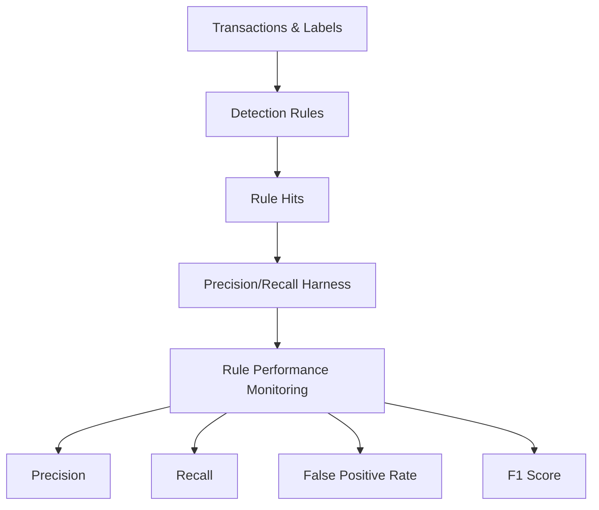

# Fraud SQL Detection Pack


A library of reusable, production-minded SQL detection queries for the most
common payment-fraud typologies — **card testing, account takeover (ATO),
merchant abuse, anomalous identifier clusters, and high-risk spend velocity** —
with a built-in **precision/recall monitoring** harness so every rule's
performance can be measured against confirmed-fraud labels.

Snowflake-compatible SQL, with dialect notes for BigQuery and Postgres.

---

## Business Impact

This project demonstrates how fraud teams can move from static rule-writing to measurable fraud detection performance.

The framework is designed to help teams:

- Reduce false positives by tuning thresholds against confirmed-fraud labels
- Improve recall by identifying missed fraud patterns across payment activity
- Monitor rule drift before fraud losses or chargebacks increase
- Compare rule performance using precision, recall, false-positive rate, and F1
- Protect customer experience by balancing fraud prevention with unnecessary friction

The goal is not just to detect suspicious activity, but to measure whether each detection rule is still effective over time.

## Why this exists

Most fraud rules rot silently. A velocity threshold that was sharp last
quarter quietly drifts as attackers adapt, and nobody notices until the
chargebacks land. This pack treats every detection as a measurable
classifier: each rule emits scored hits at transaction grain, and a single
monitoring query reports live precision, recall, false-positive rate, and F1
per rule against ground-truth labels. Rules and their evaluation live
together, version-controlled, so you can tune thresholds with evidence
instead of intuition.

## Detection Architecture


Each detection rule produces transaction-level hits with a risk_score and detection_rule label. Those hits are evaluated against confirmed-fraud labels to measure rule performance. Detection rules generate transaction-level alerts that are evaluated against confirmed fraud labels. The monitoring harness calculates precision, recall, false-positive rate, and F1 score to quantify rule effectiveness and support threshold tuning.

## What's inside

| Area | Files |
|------|-------|
| Detection rules | `queries/01`–`05` |
| Monitoring | `queries/06_precision_recall_monitoring.sql` |
| Evaluation harness | `evaluation/` (materialize hits, confusion matrix, threshold sweep) |
| Schema | `schema/snowflake_schema.sql` |
| Sample data | `data/` (synthetic, labeled, no real customer data) |
| Tests | `tests/` (validation checks + expected outputs) |
| Docs | `docs/` (methodology, data dictionary, PR framework, playbook) |
| Dialect notes | `dialect_notes/` (BigQuery & Postgres equivalents) |
| CI | `.github/workflows/sql_lint.yml` (SQLFluff) |

## The detections

| # | Rule | Typology it catches | Core signal |
|---|------|--------------------|-------------|
| 01 | Card testing velocity | Validating stolen cards | Many distinct cards + high declines + tiny amounts from one device/IP in a short window |
| 02 | ATO login/payment mismatch | Account takeover | Successful login from a **new** country/device after failed attempts, then a fast high-value payment |
| 03 | Merchant abuse | Bust-out / laundering merchants | Decline rate far above peers (robust median/MAD z-score) |
| 04 | Anomalous cluster | Fraud rings / mule networks | One device/IP fanning out across many unrelated accounts |
| 05 | High-risk payment velocity | Bust-out accounts | Rolling 24h approved count + spend crossing thresholds |

Each query exposes its thresholds as a `params` CTE at the top, returns a
`risk_score` in `[0,1]`, and tags rows with a `detection_rule` label.

## Quick start (Snowflake)

```sql
-- 1. Create tables
!source schema/snowflake_schema.sql

-- 2. Load the sample data (see docs/ for COPY INTO from a stage),
--    or point the tables at your own transactions.

-- 3. Run any single detection rule interactively
!source queries/01_card_testing_velocity.sql

-- 4. Materialize all rule hits at transaction grain
!source evaluation/precision_recall_harness.sql

-- 5. Read live precision / recall per rule
!source queries/06_precision_recall_monitoring.sql
```

## Measured performance on the sample data

Combined system (a transaction flagged if any rule fires):

| Precision | Recall | FPR | F1 |
|-----------|--------|-----|----|
| 0.858 | 0.928 | 0.026 | 0.892 |

Full per-rule breakdown in [`tests/expected_outputs.md`](tests/expected_outputs.md).

## Adapting to your warehouse

Map your transaction/login/label tables onto the columns in
`schema/snowflake_schema.sql` (see `docs/data_dictionary.md` for every
field), then tune each rule's `params` CTE to your traffic. Use
`evaluation/threshold_testing.sql` to choose operating points and
`docs/precision_recall_framework.md` for how to reason about the trade-off.

## Safety

All data in `data/` is **synthetic** and generated by a seeded script. No
real cardholder, account, or PII data is included.

## License

MIT — see [`LICENSE`](LICENSE).
